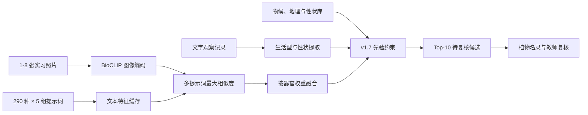

# BioCLIP v1.7 模型使用与配置教学

## 1. 当前接入状态

平台已经接入 `D:\A-newdesktop\导\bioclipv1.7\1`。v1.7 仍以 BioCLIP-2 为视觉编码器，新增多提示词集成、TTA、分类与物候/地理/性状约束。模型服务位于 `model_service`，默认使用 `http://127.0.0.1:8011`，不会修改原模型目录。本机路径写在被 Git 忽略的 `model_service\bioclip.local.bat` 中，不会发布到 GitHub。

当前电脑的实测环境：

| 项目 | 当前值 |
| --- | --- |
| Python | 3.13 |
| PyTorch | 2.13.0 CPU 版 |
| open_clip_torch | 3.3.0 |
| 计算设备 | CPU，8 线程 |
| 候选范围 | 本地知识库 290 条记录 |
| 推理策略 | v1.7 五提示词集成 + 多器官加权 |
| 约束库 | 321 条物候/地理/共现记录，311 条性状记录 |
| TTA | 默认关闭；需要时手动启用 |
| 文本特征缓存 | `model_service/cache/catalog-text-*.pt` |
| 首次五提示词编码 | 约 144 秒 |
| 缓存命中启动编码 | 约 0.06 秒 |
| 单张实测推理 | 约 0.9 至 1.7 秒 |

BioCLIP-2 的官方模型卡说明它基于 TreeOfLife-200M 训练，支持使用物种名称做零样本分类。它适合作为生物多样性研究的辅助模型，但存在长尾偏差，不能代替分类学专家复核：[BioCLIP-2 模型卡](https://huggingface.co/imageomics/bioclip-2)、[官方代码仓库](https://github.com/Imageomics/bioclip-2)。

## 2. 一键启动

先启动模型服务：

```text
双击 model_service\启动BioCLIP服务.bat
```

命令行出现以下内容才表示模型已经可用：

```text
[BioCLIP v1.7] ready: 290 labels, strategy=ensemble, tta=False, prior=True
Uvicorn running on http://127.0.0.1:8011
```

再启动前端：

```powershell
cd bashang_plant_assistant
npm run dev
```

打开 `http://127.0.0.1:5173/#/assistant`。页面状态显示“BioCLIP v1.7 · CPU”后，可以输入文字、上传照片，或同时提交两种证据。

## 3. 联合识别的正确用法

1. 同一植株可选择 1 至 8 张图。
2. 分别标注全株、花、叶、茎、果实或生境。
3. 可在文字框补充生活型、生境、花色、叶序和特殊结构；这些词会进入 v1.7 性状约束。
4. 点击“开始识别”，再进入植物名录核对形态特征与参考图片。
5. 需要保存样本时，从识别页进入“样本补录”；记录不能直接写回正式名录。

界面显示的是“闭集相对得分”。它回答的是“在这 290 个候选中，哪一个图文向量最接近”，不是物种真实概率。例如 `61.9%` 不等于“有 61.9% 的科学把握”。若真实物种不在本地名录，模型仍会从 290 条记录中选出最相近者。

## 4. 系统怎样工作



CLIP 类模型把图片和文字映射到同一个向量空间。v1.7 为每个拉丁名生成五种提示词，取各提示词相似度中的最大值，再在 290 种植物内计算闭集相对分数。文字观察不会直接替换视觉结果，而是对生活型、物候、区域和性状冲突的候选降权；返回值保留原始分数、约束因子和原因。

花和果实的权重为 `1.2`，叶为 `1.0`，全株为 `0.9`，生境为 `0.7`。这只是当前工程先验，后续应使用验证集估计更合理的权重。

## 5. 首次启动与缓存

第一次运行会生成 290 个物种的文本特征。CPU 上可能需要 1 至 4 分钟。缓存保存于：

```text
model_service\cache\catalog-text-*.pt
```

再次启动时文本缓存读取约为百分之一秒，但模型权重仍需装入内存。如果知识库拉丁名、提示模板或模型名称变化，缓存文件名会自动变化并重新生成。

可以删除缓存来强制重建：

```powershell
Remove-Item model_service\cache\catalog-text-*.pt
```

## 6. 接口检查与独立测试

检查服务状态：

```powershell
Invoke-RestMethod http://127.0.0.1:8011/health
```

应看到 `modelReady: true`、`catalogSize: 290` 和实际 `device`。

不打开网页也可以测试图片：

```powershell
python model_service\smoke_test.py `
  public\local-samples\display\S0057.webp `
  public\local-samples\display\S0058.webp `
  --parts 全株 花
```

## 7. 换电脑配置

需要迁移两部分：

1. 完整平台目录 `bashang_plant_assistant`；
2. BioCLIP 模型目录，约 8.3GB。

模型可放在其他位置，但应复制 `model_service\bioclip.local.bat.example` 为 `bioclip.local.bat`，再填写：

```bat
set "BIOCLIP_HOME=你的模型目录"
set "BIOCLIP_ENGINE_HOME=你的模型目录"
set "BIOCLIP_ENGINE_VERSION=1.7"
```

安装 Python 依赖：

```powershell
cd model_service
python -m venv .venv
.\.venv\Scripts\Activate.ps1
python -m pip install --upgrade pip
pip install -r requirements.txt
```

如果使用虚拟环境，把批处理中的启动命令改为：

```bat
"%~dp0.venv\Scripts\python.exe" -m uvicorn app:app --host 127.0.0.1 --port 8011
```

## 8. GPU 配置

当前安装的是 CPU 版 PyTorch。更换为 NVIDIA GPU 电脑后，应先根据显卡驱动和 CUDA 版本，在 [PyTorch 官方安装页](https://pytorch.org/get-started/locally/) 生成对应安装命令，不要混装多个 CUDA 版本。

验证 GPU：

```powershell
python -c "import torch; print(torch.cuda.is_available()); print(torch.cuda.get_device_name(0) if torch.cuda.is_available() else 'CPU')"
```

结果为 `True` 后，将批处理改为：

```bat
set "BIOCLIP_DEVICE=cuda"
```

显存不足时先减少一次上传的图片数量。不要在同一块小显存 GPU 上同时常驻多个大模型。

## 9. 环境变量

| 变量 | 作用 | 默认值 |
| --- | --- | --- |
| `BIOCLIP_HOME` | Hugging Face 本地缓存根目录 | `models\bioclip` |
| `BIOCLIP_ENGINE_HOME` | v1.7 脚本与 constraints 根目录 | 与 `BIOCLIP_HOME` 相同 |
| `BIOCLIP_ENGINE_VERSION` | 健康检查与页面显示版本 | `1.7` |
| `BIOCLIP_DEVICE` | `cpu`、`cuda` 或 `auto` | `auto` |
| `BIOCLIP_TOP_K` | 返回候选数 | `10` |
| `BIOCLIP_CPU_THREADS` | CPU 推理线程数 | `8` |
| `BIOCLIP_TEXT_BATCH_SIZE` | 首次文本编码批量 | `64` |
| `BIOCLIP_PRIOR` | 启用物候、地理和性状约束 | `1` |
| `BIOCLIP_PRIOR_REGION` | 约束区域 | `broad_grassland` |
| `BIOCLIP_PRIOR_STRENGTH` | 约束惩罚强度，0 至 1 | `1.0` |
| `BIOCLIP_TTA` | 启用 1 至 8 个测试时增强 | `0` |
| `BIOCLIP_TTA_AUGMENTS` | TTA 变换数量 | `4` |
| `PLANT_KNOWLEDGE_BASE` | 植物 JSON 路径 | 项目知识库 |
| `PLANT_APP_ORIGINS` | 允许访问接口的前端来源 | 本地 5173/4173 |

前端 `.env.local` 只保存接口地址，不能存模型密钥：

```dotenv
VITE_VISION_API_URL=http://127.0.0.1:8011/v1/identify
VITE_MODEL_HEALTH_URL=http://127.0.0.1:8011/health
VITE_MODEL_TIMEOUT_MS=180000
```

修改 `.env.local` 后必须重启 Vite。

## 10. 当前实测与局限

使用知识库实习样本 `S0057.webp` 测试：

- 只输入单张全株图：约 1.63 秒，第一候选委陵菜，相对得分 64.3%；
- 同图加入“灌木、黄色花、羽状复叶、山坡灌丛”：约 0.91 秒，性状库把草本候选按 0.40 或 0.15 等因子降权；
- 第二次启动命中文本缓存，标签编码从约 144 秒降到约 0.06 秒。

这组结果证明文字约束已经真实参与重排，同时也说明约束只能降权，不能凭一句描述自动制造正确物种。模型在坝上近缘种的种级区分上仍不足。增加图片不保证结果必然正确，低质量或高度相似的多图也可能强化同一个错误。

## 11. 怎样把模型做得更有实习价值

建议按以下顺序推进：

1. 建立按原始植株分组的测试集，报告 Top-1、Top-5、Top-10 和属级准确率。
2. 制作混淆矩阵，优先处理委陵菜属、蒿属、蓼科、禾本科和莎草科等易混类群。
3. 补齐花、叶背、茎节、果实与生境图，不只增加同角度照片。
4. 对旧名、接受名和异名建立分类学名称映射，但保留原始名录字段。
5. 先尝试每种植物的本地参考图原型向量，再评估 BioCLIP 线性探针或参数高效微调。
6. 用教师最终确认结果做独立测试，不能把同一植株的近似照片同时放入训练集和测试集。

主体清晰、背景干扰少的照片通常更适合当前模型。真正需要持续优化的是本地种级数据、分类学标签、评价设计和复核流程。

## 12. 常见故障

| 现象 | 处理 |
| --- | --- |
| `modelReady` 为 `false` | 查看服务窗口中的加载错误 |
| 找不到本地缓存 | 检查 `BIOCLIP_HOME\huggingface` 是否存在 |
| `8011` 被占用 | 同时修改批处理端口和 `.env.local` 两个 URL |
| 页面一直显示未就绪 | 确认服务可访问，再重启 `npm run dev` |
| 首次启动很慢 | 等待文本缓存生成，后续会复用 |
| 中文候选乱码 | 终端显示编码不影响浏览器；批处理已使用 UTF-8 代码页 |
| 结果集中在近缘种 | 查看 Top-10，并结合器官特征与教师复核 |
| 推理内存不足 | 减少图片数，关闭其他模型进程，或改用 GPU |

## 13. 使用边界

- 结果只用于实习辅助和样本整理，不用于自动发布正式物种记录。
- 上传到当前服务的图片只在本机内存中推理，接口不会保存原图。
- 点击“保存为待复核”会把图片 Blob 和模型候选存入浏览器 IndexedDB。
- 对保护物种或敏感地点，仍应移除精确坐标和人员标识。
